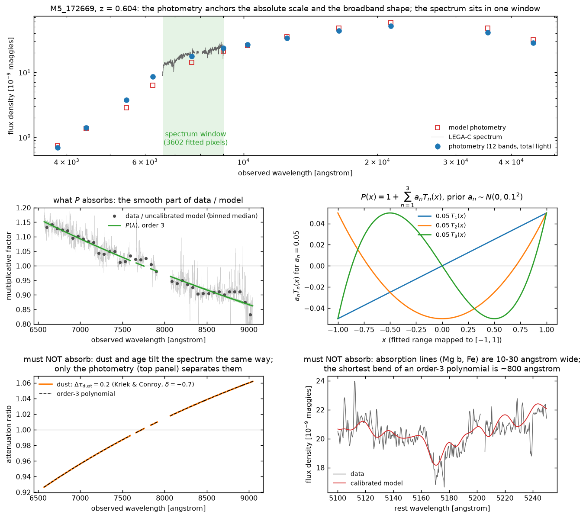
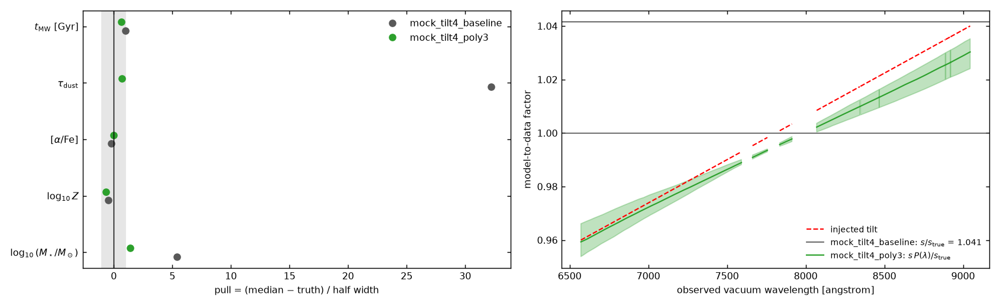
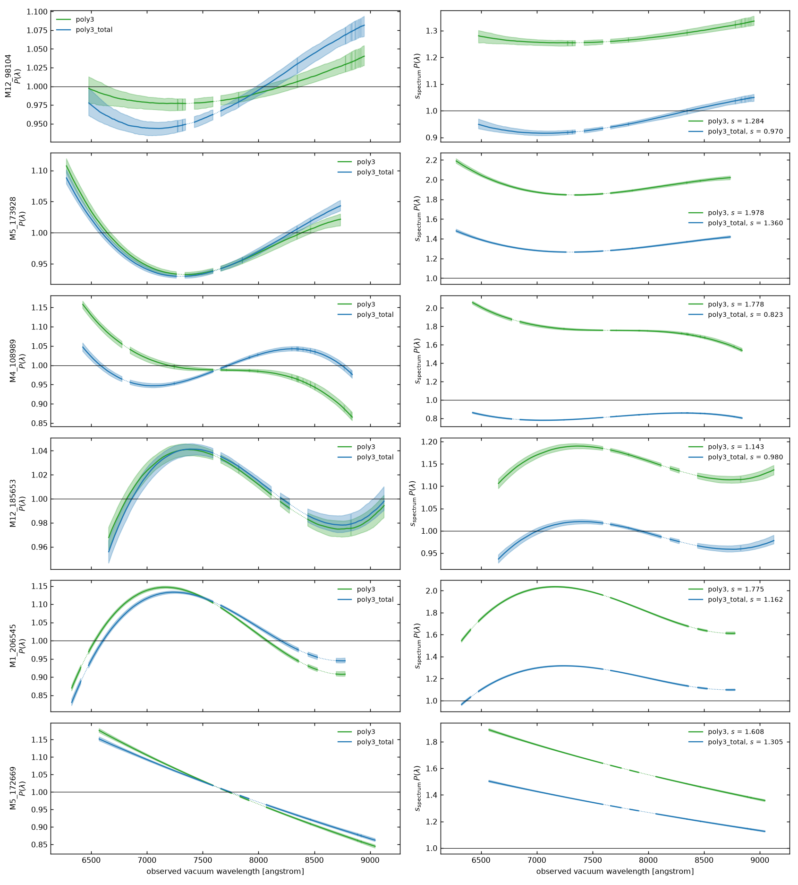
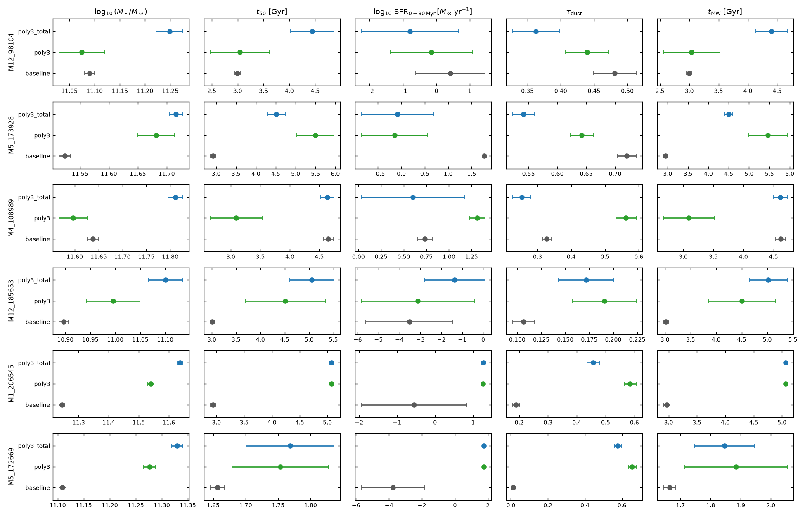
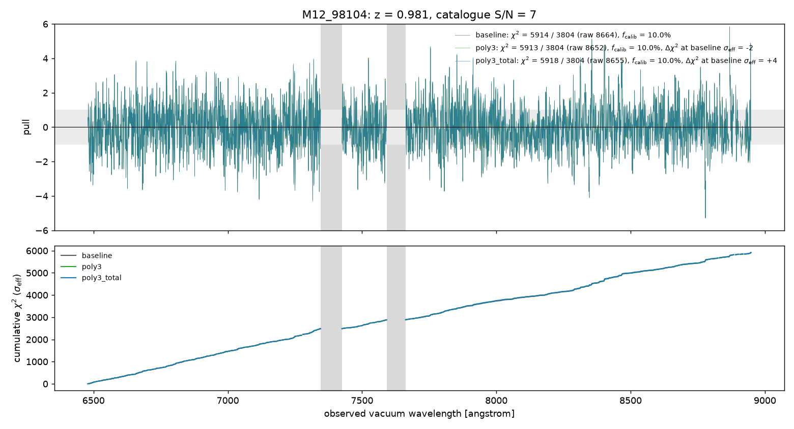
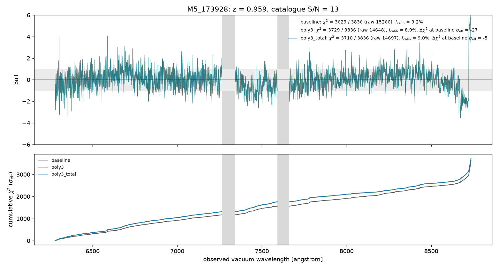
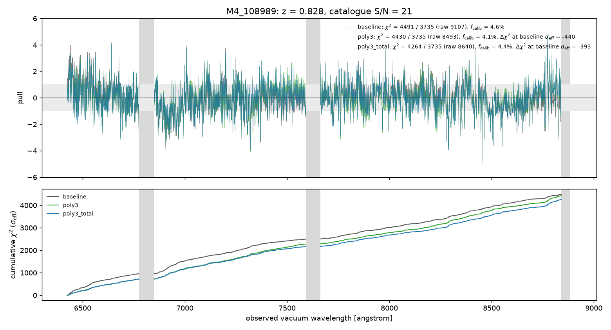
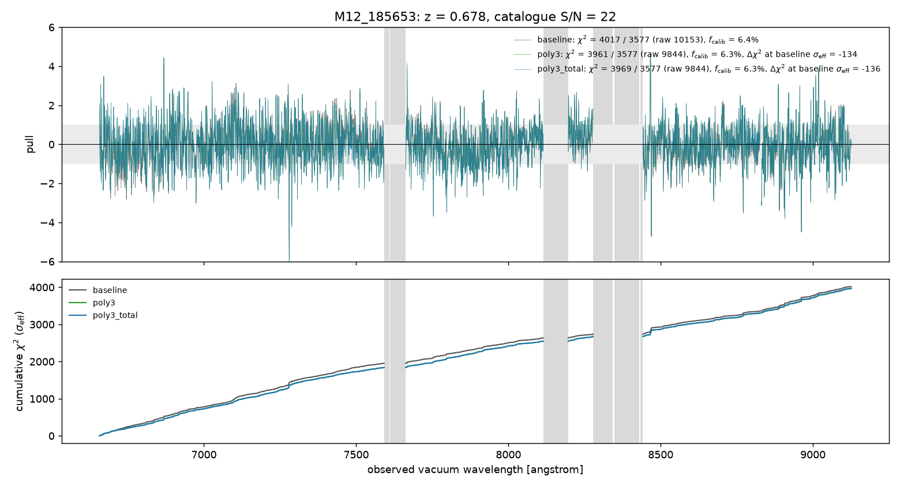
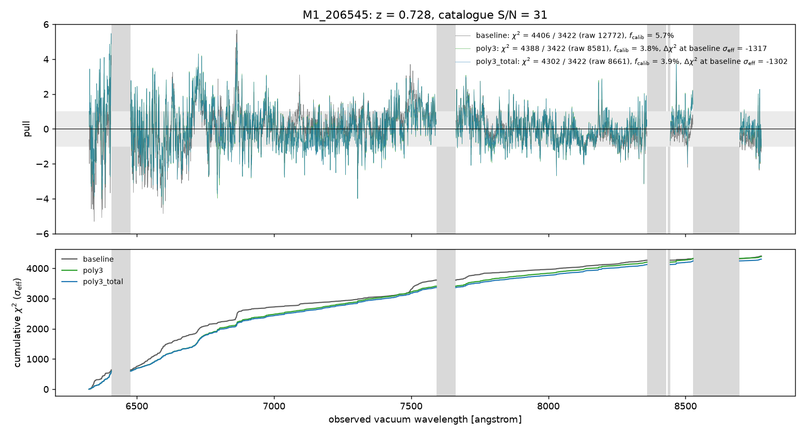
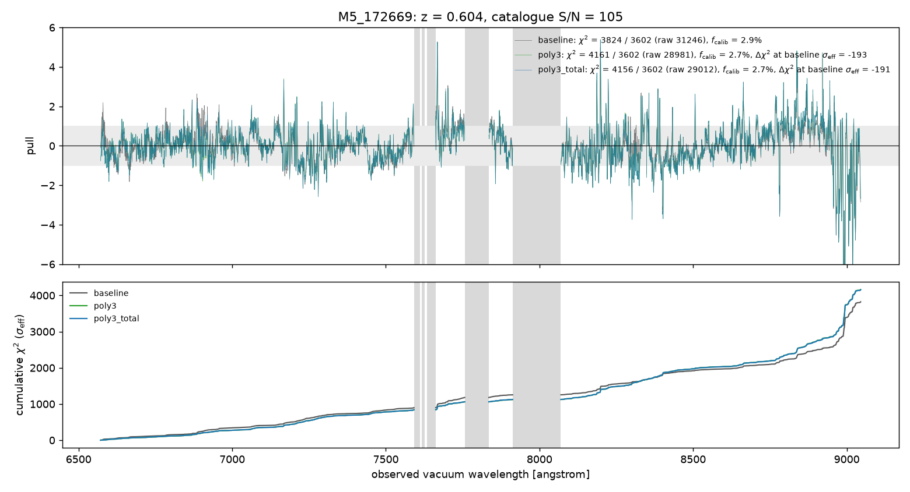

# Calibration polynomial in the Ceridwen DR2 pipeline

Report for the supervisor meeting follow-up of 2026-09-05. Card t_ab2b8a0b. Written 2026-09-06.

> **Production defaults changed.** `notebooks/ceridwen_integrated_photometry_spectra.ipynb` now defaults to `CERIDWEN_CALIBRATION_ORDER=3` and `CERIDWEN_PHOTOMETRY=cosmos_total` (parent commit `40ad5a4`). Every fit launched from now on uses the polynomial and the Laigle et al. (2016) total photometry. The 187-galaxy summary (`results/dr2-quiescent-summary.csv`, 2026-08-31) and the sibling card's diagnostics are still the old pipeline (order 0, 3" aperture photometry). To reproduce the old behaviour, set `CERIDWEN_CALIBRATION_ORDER=0 CERIDWEN_PHOTOMETRY=cosmos_ap3` in the environment before the notebook or the shard runner. A re-run of the 187 galaxies is about 16 GPU hours, about $1.5 on an RTX 5060.

## Summary

- The Ceridwen spectrum likelihood now carries an order-3 Chebyshev calibration polynomial, marginalised analytically (`ceridwen` commit `0e8ef3e` on the fork branch `absorption-mask`, 20 tests). The production notebook reads the order from `CERIDWEN_CALIBRATION_ORDER` (default 3, was off) and the photometric anchor from `CERIDWEN_PHOTOMETRY` (default `cosmos_total`, was `cosmos_ap3`). Both defaults follow the 2026-09-03 decision. `CERIDWEN_CALIBRATION_ORDER=0 CERIDWEN_PHOTOMETRY=cosmos_ap3` reproduces production.
- Six DR2 galaxies ran in three arms (production, polynomial, polynomial with total photometry), plus two tilted mocks, on one Vast.ai RTX 5060 for $0.23 of the shared $2 cap. The instance is destroyed.
- Acceptance: on the card's literal criterion (stored χ² per the sibling card's definition) the test fails for M5_172669 (+337 / +332), M5_173928 (+100 / +82) and marginally M12_98104 `poly3_total` (+4.2). The two M5 rises come from a smaller fitted noise fraction; at fixed weights the same fits are better. Whether the criterion should be read at fixed weights is Liu Hao's call. See "Acceptance test".
- Helped: the mock (a 4 percent tilt gave a 32σ dust bias without the polynomial and none with it), M4_108989 and M12_185653 with total photometry (photometric χ² 139 → 13 and 37 → 11, stored spectral χ² −227 and −48), and M1_206545 on the spectrum alone (raw χ² −4191).
- Did not help: M5_172669 and M1_206545 need 15 to 30 percent polynomials and keep a photometric χ² of 65 to 131 for 12 bands. There the polynomial absorbs a model mismatch, not a calibration error, and dust, age and mass move by many formal σ. M12_98104 (S/N 6.6) does not change on aperture photometry. Its age posterior widens tenfold, which is the honest width once the continuum slope is no longer trusted.
- The masses rise by 0.16 to 0.39 dex in the total-photometry arm for all six galaxies. That is the anchor, not the polynomial.

## What changed in the pipeline

- `ceridwen/ceridwen/likelihood/calibration.py` (fork branch `absorption-mask`, commit `0e8ef3e`): `PolynomialCalibration`. A Chebyshev polynomial P(x) = 1 + Σ a_n T_n(x) multiplies the model spectrum. The coefficients are integrated out analytically at every likelihood call. Per-coefficient Gaussian priors. Coefficient covariance and a posterior sampler for the calibration vector.
- `DiagonalGaussianLikelihood(calibration=...)`: the noise model is evaluated once at the uncalibrated model, the polynomial is solved with that effective σ, and P · μ enters the Gaussian kernel. Without `calibration=` nothing changes.
- `notebooks/ceridwen_integrated_photometry_spectra.ipynb` (project commit `c65c7ae`): switches `CERIDWEN_CALIBRATION_ORDER` (order, 0 = off), `CERIDWEN_CALIBRATION_PRIOR` (prior width, default 0.1), `CERIDWEN_PHOTOMETRY` (`cosmos_ap3` or `cosmos_total`). The result files record the settings. The derived-output file gains a `calibration` group (coefficient draws, P quantiles, Chebyshev coordinate). The notebook plots P(λ) and s · P(λ) with bands. Pulls and χ² are computed against P · μ.
- `scripts/download_legac_dr2_aperture_photometry.py`: fetches the COSMOS2015 aperture table that `cosmos_total` needs (raw file in `data/raw/cosmos2015/`, documented in its README).
- `scripts/calibration_arms_vast.py`: rents one RTX 5060, runs the arms below, pulls the results, destroys the instance, records the spend.
- Tests: `ceridwen/tests/test_polynomial_calibration.py`, 20 tests, all pass on CPU.

## Physical explanation

#### What the polynomial is for

A joint fit compares two data sets that measure different things.

- The twelve photometric bands (u to IRAC 4.5 µm) measure the total light of the galaxy over a factor of ten in wavelength. Their absolute calibration is good to a few percent per band. They fix the stellar mass and the broadband shape of the SED.
- The LEGA-C spectrum has about 3600 fitted pixels between 6300 and 8900 Å in the observed frame. At z = 0.6 to 0.8 that is 3900 to 5500 Å in the rest frame. The pixels carry the absorption-line strengths and widths, the 4000 Å break and the fine continuum shape. By summed (S/N)² the spectrum outweighs the photometry by a factor of 200 to 800 (absorption-line-mask note).

The smooth shape of the spectrum is the part that is not trustworthy at the percent level. Four instrumental effects change it.

1. Slit losses. A 1" slit on a galaxy of similar size loses 10 to 40 percent of the light (LEGA-C DR2 release notes). Seeing shrinks with wavelength, so the loss depends on wavelength.
2. Differential atmospheric refraction. The atmosphere displaces the blue image of a target against the red image. A slit aligned at one wavelength loses more light at the other end of the spectrum.
3. Flux-calibration errors. The response curve, the extinction curve and the standard star all leave smooth residual errors. LEGA-C DR2 did not use standard stars at all. The team scaled each spectrum onto a FAST template of the UltraVISTA photometry with a fifth-order polynomial (Straatman et al. 2018, §2.3.2).
4. Aperture against total light. The slit sees part of the galaxy. The photometry sees all of it. A radial colour gradient makes the ratio depend on wavelength.

Every one of these is a smooth multiplicative function of wavelength. None of them changes an absorption line. That is what the polynomial models: a smooth multiplicative correction with a handful of coefficients.

#### What it must not absorb

Dust attenuation and stellar age also change the continuum smoothly. A change of 0.2 in the optical depth of the Kriek and Conroy curve tilts the LEGA-C window by about 15 percent. An order-1 polynomial can copy that tilt exactly (explainer figure, bottom left). Age moves the 4000 Å break and the slope of the continuum. Metallicity changes the line blanketing over a few hundred Å. On the spectrum alone, the polynomial and the dust are one degree of freedom. This degeneracy is not a defect of the polynomial. It is the design point: the spectrum gives up its continuum slope and keeps its lines.

Three things stop the polynomial from eating the physics.

- The photometry. The polynomial multiplies the spectrum prediction only. The fit compares the model photometry with the twelve bands without it. A dust or age change that tilts the model spectrum also changes the broadband colours from u to Ks. The catalogue measures those colours to about 5 percent. When the polynomial tries to absorb a physical tilt, the photometric χ² pays for it. The mock below shows this. We injected a 4 percent tilt in the spectrum only. The polynomial recovers it. The parameters stay on the truth, because the photometry did not move.
- The order. An order-n Chebyshev polynomial has n − 1 turning points over the fitted range. The shortest structure it can follow spans about (range / n). For order 3 over 2500 Å that is 800 Å in the observed frame, 500 Å in the rest frame. Absorption lines are 10 to 30 Å wide and the 4000 Å break is 100 to 200 Å wide. The polynomial cannot bend on those scales (explainer figure, bottom right).
- The prior. Each shape coefficient a_n has a Gaussian prior with width 0.1. That says: a correction of more than about 10 percent per term is unlikely. In a full-spectrum fit the 3600 pixels pin the coefficients to 0.3 to 1.4 percent and the prior is irrelevant. It matters only in fits with few pixels (the features-only mask). The prior does not stop the polynomial from following a real dust tilt. Only the photometry does.

The anchor therefore decides what the polynomial means. The production 3" aperture fluxes carry no aperture-to-total offset, no Galactic extinction and no Table 3 zero points. That anchor carries its own tilt and sits 25 to 50 percent too faint. The polynomial then follows it into the wrong dust and age (tilt-origin experiment of 2026-09-02). The `poly3_total` arm below uses the Laigle et al. (2016) total SED for that reason.



The diagram. Top: the M12_185653 spectrum and its 12 bands with the fitted polynomial. Bottom left: a change of 0.2 in the dust optical depth against an order-1 polynomial over the LEGA-C window. Bottom right: the shortest bend of an order-3 polynomial (about 800 Å) against absorption-line widths.

#### Equations

Data model for pixel i of the spectrum, with s the sampled `spectrum_scaling` and μ_i(θ) the model spectrum:

    d_i = s · P(x_i) · μ_i(θ) + n_i,    n_i ~ N(0, σ_eff,i²),    σ_eff,i² = σ_i² + (f · s · μ_i)²

    P(x) = 1 + Σ_{n=1}^{N} a_n T_n(x),    x = (λ − λ_mid) / λ_half in [−1, 1] over the fitted pixels

The photometry uses μ(θ) without P. The coefficients a enter linearly. With the Gaussian prior a ~ N(0, Σ_p) they integrate out in closed form. Write D_in = T_n(x_i) · s · μ_i / σ_eff,i for the whitened design matrix. Write t_i = (d_i − s μ_i) / σ_eff,i for the whitened residual. Then:

    N = Dᵀ D + Σ_p⁻¹,    â = N⁻¹ Dᵀ t

    ln L(θ) = ln N(d | s P(â) μ, σ_eff) − ½ âᵀ Σ_p⁻¹ â + ½ ln|Σ_p⁻¹| − ½ ln|N|

The first two terms are the profile likelihood that Prospector's `polyopt` uses. The last two are the Occam factor of the marginalisation. The whole thing costs one 3 × 3 solve and one 3 × 3 log-determinant per likelihood call. It adds no sampled dimension. Given θ, the coefficients have the posterior N(â, N⁻¹). The band on P(λ) in the figures therefore combines the spread of â over the posterior of θ with one draw from N⁻¹ per sample.

#### Defaults

- Order 3, the default (`CERIDWEN_CALIBRATION_ORDER=3`). Orders 1, 3 and 5 all remove a pure tilt on mocks (2026-09-02 experiment). Order 1 cannot follow curvature. Order 5 pays extra posterior width for nothing. LEGA-C's own calibration used a fifth-order polynomial, so the residual is low order. The shortest bend of order 3 is 800 Å, above every spectral feature the model must keep.
- Constant term in `spectrum_scaling`, not in the polynomial (Prospector convention). This keeps the sampled parameter set identical to production, so every downstream reader of the result files still works. The BAGPIPES convention puts the constant inside the polynomial and drops the scaling. It gives the same posteriors with one fewer dimension.
- Prior width 0.1 per coefficient. Wide enough for any calibration error the release notes describe, and irrelevant in a full-spectrum fit.
- Marginalised, not profiled. The Occam term is exact and costs one log-determinant. Over the posterior of a joint fit it varies by 0.1 to 0.4 nats, so the profile would give the same answer here. The marginal is the statement of the model.

## Experiment

`scripts/calibration_arms_vast.py` runs the production notebook through the DR2 shard runner (`run_ceridwen_vast_multi_gpu.py`, one shard, one target per cell) on one Vast.ai RTX 5060 (instance 49915205, $0.093 per hour). Every cell uses the production sampler settings (BlackJAX NSS, 500 live points, 65 inner steps, 100 deletions, logZ tolerance −5) and the production seed of its target, so a baseline cell is a repeat of the stored production fit.

Three arms per galaxy:

- `baseline`: production. 3" aperture photometry, `spectrum_scaling`, `log_f_calib`, no polynomial.
- `poly3`: baseline plus the order-3 marginalised polynomial.
- `poly3_total`: `poly3` anchored to the Laigle et al. (2016) total SED (aperture-to-total offset, Galactic extinction, Table 3 zero points).

Six galaxies span the sample in signal-to-noise and redshift: M12_98104 (catalogue S/N 6.6, z = 0.98), M5_173928 (13, 0.96), M12_185653 (22, 0.68), M4_108989 (21, 0.83), M1_206545 (31, 0.60) and M5_172669 (105, 0.68).

Two mocks of M5_172669 test the recovery. The truth vector is the posterior median of the stored full-spectrum fit. The mock spectrum carries a 4 percent end-to-end linear tilt and the production noise. The mock photometry carries no tilt. One mock arm runs without the polynomial, one with it. Seed 1 for both.

Two χ² are reported for every spectrum. The raw χ² uses the pipeline uncertainties only and compares arms on the same footing. The stored χ² uses the effective σ of the fit, which includes the fitted `log_f_calib` fraction of the model, and is the number the sibling card's diagnostics plot. A fit that lowers `log_f_calib` shrinks its own σ, so its stored χ² can rise while its residuals fall. The acceptance test below reports both.

## Results

Figures are in `astro-calibration-2026-09-06/` beside this report: `calibration-explainer.png` (the one diagram: what the polynomial can follow and what it cannot), `mock-tilt.png`, `polynomial-vectors.png` (P(λ) and s · P(λ) with 16-84 bands for all six galaxies), `parameters-before-after.png`, `chi2-<galaxy>.png` (pulls and cumulative χ² for the three arms) and `sibling-chi2-<arm>-<galaxy>.png` (the sibling card's spectral χ² figure for every fit).



















### Spectra and photometry

Raw χ² uses the pipeline σ. Stored χ² uses σ_eff² = σ² + (f_calib · model)² over the fitted pixels. `s` is `spectrum_scaling`. P tilt is P(λ_max) − P(λ_min) at the posterior median. Δ ln Z is against the baseline arm of the same galaxy.

| galaxy | z | S/N | arm | raw χ² | χ² (σ_eff) | phot χ² | f_calib [%] | s | P tilt [%] | Δ ln Z |
| --- | --- | --- | --- | --- | --- | --- | --- | --- | --- | --- |
| M12_98104 | 0.981 | 7 | baseline | 8664 | 5914 / 3804 | 49.5 | 10.0 | 1.369 | — | +0.0 |
|  | 0.981 | 7 | poly3 | 8652 | 5913 / 3804 | 44.8 | 10.0 | 1.284 | +4.3 | +0.1 |
|  | 0.981 | 7 | poly3_total | 8655 | 5918 / 3804 | 10.1 | 10.0 | 0.970 | +10.6 | +18.1 |
| M5_173928 | 0.959 | 13 | baseline | 15266 | 3629 / 3836 | 143.3 | 9.2 | 2.285 | — | +0.0 |
|  | 0.959 | 13 | poly3 | 14648 | 3729 / 3836 | 88.7 | 8.9 | 1.978 | -7.7 | +7.6 |
|  | 0.959 | 13 | poly3_total | 14697 | 3710 / 3836 | 48.2 | 9.0 | 1.360 | -4.1 | +3.5 |
| M4_108989 | 0.828 | 21 | baseline | 9107 | 4491 / 3735 | 139.1 | 4.6 | 1.484 | — | +0.0 |
|  | 0.828 | 21 | poly3 | 8493 | 4430 / 3735 | 152.6 | 4.1 | 1.778 | -25.2 | +202.3 |
|  | 0.828 | 21 | poly3_total | 8640 | 4264 / 3735 | 12.8 | 4.4 | 0.823 | -6.8 | +250.0 |
| M12_185653 | 0.678 | 22 | baseline | 10153 | 4017 / 3577 | 36.6 | 6.4 | 1.118 | — | +0.0 |
|  | 0.678 | 22 | poly3 | 9844 | 3961 / 3577 | 39.2 | 6.3 | 1.143 | +2.7 | +53.2 |
|  | 0.678 | 22 | poly3_total | 9844 | 3969 / 3577 | 11.1 | 6.3 | 0.980 | +4.4 | +67.7 |
| M1_206545 | 0.728 | 31 | baseline | 12772 | 4406 / 3422 | 133.2 | 5.7 | 1.380 | — | +0.0 |
|  | 0.728 | 31 | poly3 | 8581 | 4388 / 3422 | 101.9 | 3.8 | 1.775 | +4.4 | +812.6 |
|  | 0.728 | 31 | poly3_total | 8661 | 4302 / 3422 | 64.6 | 3.9 | 1.162 | +13.8 | +834.7 |
| M5_172669 | 0.604 | 105 | baseline | 31246 | 3824 / 3602 | 170.9 | 2.9 | 1.238 | — | +0.0 |
|  | 0.604 | 105 | poly3 | 28981 | 4161 / 3602 | 130.8 | 2.7 | 1.608 | -28.2 | +288.5 |
|  | 0.604 | 105 | poly3_total | 29012 | 4156 / 3602 | 100.1 | 2.7 | 1.305 | -25.1 | +281.7 |

### Derived parameters

Median ± half the 16-84 range. t50 is the lookback time at which half the mass had formed. SFR is the youngest SFH bin (0 to 30 Myr) times the median mass; the prior dominates it for quiescent galaxies. t_MW is the mass-weighted age.

| galaxy | arm | log M⋆ | t50 [Gyr] | log SFR (0-30 Myr) | τ_dust | t_MW [Gyr] |
| --- | --- | --- | --- | --- | --- | --- |
| M12_98104 | baseline | 11.090 ± 0.010 | 3.00 ± 0.05 | 0.42 ± 1.04 | 0.481 ± 0.032 | 2.99 ± 0.04 |
|  | poly3 | 11.075 ± 0.045 | 3.04 ± 0.58 | -0.15 ± 1.24 | 0.440 ± 0.032 | 3.04 ± 0.48 |
|  | poly3_total | 11.248 ± 0.026 | 4.44 ± 0.42 | -0.79 ± 1.46 | 0.363 ± 0.035 | 4.40 ± 0.27 |
| M5_173928 | baseline | 11.524 ± 0.010 | 2.92 ± 0.07 | 1.77 ± 0.02 | 0.720 ± 0.016 | 2.94 ± 0.05 |
|  | poly3 | 11.682 ± 0.032 | 5.50 ± 0.46 | -0.15 ± 0.70 | 0.642 ± 0.020 | 5.46 ± 0.48 |
|  | poly3_total | 11.716 ± 0.012 | 4.51 ± 0.23 | -0.08 ± 0.78 | 0.541 ± 0.019 | 4.50 ± 0.11 |
| M4_108989 | baseline | 11.638 ± 0.012 | 4.65 ± 0.09 | 0.74 ± 0.08 | 0.327 ± 0.013 | 4.62 ± 0.08 |
|  | poly3 | 11.597 ± 0.030 | 3.09 ± 0.44 | 1.31 ± 0.09 | 0.562 ± 0.030 | 3.09 ± 0.42 |
|  | poly3_total | 11.811 ± 0.016 | 4.64 ± 0.11 | 0.60 ± 0.57 | 0.253 ± 0.028 | 4.61 ± 0.12 |
| M12_185653 | baseline | 10.897 ± 0.009 | 3.01 ± 0.05 | -3.52 ± 2.08 | 0.106 ± 0.012 | 3.02 ± 0.05 |
|  | poly3 | 10.996 ± 0.054 | 4.51 ± 0.82 | -3.13 ± 2.70 | 0.191 ± 0.033 | 4.50 ± 0.66 |
|  | poly3_total | 11.100 ± 0.035 | 5.06 ± 0.45 | -1.36 ± 1.45 | 0.172 ± 0.029 | 5.02 ± 0.37 |
| M1_206545 | baseline | 11.244 ± 0.009 | 2.94 ± 0.05 | -0.55 ± 1.39 | 0.189 ± 0.013 | 2.96 ± 0.06 |
|  | poly3 | 11.540 ± 0.010 | 5.07 ± 0.04 | 1.26 ± 0.03 | 0.585 ± 0.020 | 5.06 ± 0.03 |
|  | poly3_total | 11.638 ± 0.009 | 5.07 ± 0.02 | 1.27 ± 0.04 | 0.457 ± 0.021 | 5.06 ± 0.01 |
| M5_172669 | baseline | 11.109 ± 0.007 | 1.66 ± 0.01 | -3.76 ± 1.93 | 0.012 ± 0.005 | 1.66 ± 0.02 |
|  | poly3 | 11.276 ± 0.012 | 1.75 ± 0.07 | 1.76 ± 0.06 | 0.655 ± 0.021 | 1.88 ± 0.17 |
|  | poly3_total | 11.329 ± 0.011 | 1.77 ± 0.07 | 1.76 ± 0.05 | 0.577 ± 0.019 | 1.85 ± 0.10 |

### Before and after

Every delta is the polynomial arm minus the baseline arm of the same galaxy. "repeat scatter" = the production fit of 2026-08-31 (same seed) minus this baseline. "Δ χ² (baseline σ_eff)" scores both fits with the baseline f_calib, so the weights are equal.

| galaxy | arm | Δ raw χ² | Δ χ² (σ_eff) | Δ χ² (baseline σ_eff) | repeat scatter | Δ phot χ² | Δ log M⋆ | Δ t50 [Gyr] | Δ τ_dust | Δ t_MW [Gyr] |
| --- | --- | --- | --- | --- | --- | --- | --- | --- | --- | --- |
| M12_98104 | poly3 | -12 | -0.8 | -2.0 | -1.0 | -4.7 | -0.016 | +0.05 | -0.041 | +0.05 |
|  | poly3_total | -9 | +4.2 | +3.7 | -1.0 | -39.4 | +0.158 | +1.45 | -0.118 | +1.41 |
| M5_173928 | poly3 | -618 | +100.2 | -27.1 | +0.6 | -54.7 | +0.158 | +2.58 | -0.077 | +2.51 |
|  | poly3_total | -569 | +81.7 | -4.8 | +0.6 | -95.1 | +0.192 | +1.60 | -0.178 | +1.56 |
| M4_108989 | poly3 | -614 | -61.6 | -440.1 | -23.8 | +13.5 | -0.042 | -1.56 | +0.235 | -1.53 |
|  | poly3_total | -467 | -227.4 | -392.6 | -23.8 | -126.3 | +0.173 | -0.02 | -0.074 | -0.01 |
| M12_185653 | poly3 | -308 | -55.6 | -133.7 | +4.4 | +2.6 | +0.099 | +1.50 | +0.084 | +1.48 |
|  | poly3_total | -309 | -47.7 | -136.5 | +4.4 | -25.5 | +0.204 | +2.04 | +0.065 | +2.00 |
| M1_206545 | poly3 | -4191 | -18.7 | -1316.9 | -5.3 | -31.3 | +0.296 | +2.14 | +0.396 | +2.10 |
|  | poly3_total | -4111 | -104.0 | -1302.2 | -5.3 | -68.6 | +0.394 | +2.14 | +0.268 | +2.10 |
| M5_172669 | poly3 | -2265 | +337.3 | -193.2 | +2.1 | -40.1 | +0.167 | +0.10 | +0.642 | +0.22 |
|  | poly3_total | -2234 | +331.8 | -191.2 | +2.1 | -70.8 | +0.220 | +0.11 | +0.565 | +0.18 |

### Mocks

Truth: M5_172669 (log M⋆ = 11.110, τ_dust = 0.011, t_MW = 1.66 Gyr). A 4 percent linear tilt on the spectrum only, production noise, seed 1. Pulls from the truth without the polynomial: log M⋆ +5.4σ, τ_dust +32σ. With it: +1.4σ and +0.7σ.

| mock arm | log M⋆ | τ_dust | s | t_MW [Gyr] | raw χ² | phot χ² | ln Z |
| --- | --- | --- | --- | --- | --- | --- | --- |
| mock_tilt4_baseline | 11.167 ± 0.011 | 0.151 ± 0.004 | 1.289 ± 0.020 | 1.77 ± 0.11 | 3625 | 22.5 | 236487.5 |
| mock_tilt4_poly3 | 11.126 ± 0.012 | 0.023 ± 0.016 | 1.232 ± 0.019 | 1.72 ± 0.10 | 3590 | 4.0 | 236493.6 |

## Where it helped and where it did not

- Mock (M5_172669 truth, 4 percent tilt): helped. The tilt goes into P (a_1 = 0.035 ± 0.006 for 0.04 injected, the rest into s). Dust returns to the truth (0.023 ± 0.016 for 0.011, against 0.151 ± 0.004 without the polynomial). The photometric χ² drops from 22.5 to 4.0 and ln Z rises by 6. The recovered s · P differs from the injected vector by at most 1.0 percent.
- M4_108989 (S/N 21): helped, but only with total photometry. On aperture photometry the polynomial reaches −25 percent and dust doubles. t50 drops from 4.6 to 3.1 Gyr and the photometric χ² gets worse (139 → 153). With total photometry the polynomial is −7 percent, t50 returns to 4.6 Gyr, the photometric χ² is 13 and the stored spectral χ² falls by 227. The anchor decides what the polynomial means.
- M12_185653 (S/N 22): helped. Photometric χ² 37 → 11 with total photometry, stored spectral χ² −48 to −56, polynomial within ±4 percent. t50 moves from 3.0 to 4.5 to 5.1 Gyr with an error bar ten times wider than before.
- M5_173928 (S/N 13): mixed. Photometric χ² 143 → 48 and raw spectral χ² −569 with total photometry. But the polynomial is a 7 to 10 percent bowl. t50 moves from 2.9 to 4.5 to 5.5 Gyr. The baseline needed s = 2.29: the 3" fluxes sit a factor 2.3 below the spectrum. Its stored χ² rises by 82 to 100 because f_calib fell. At the baseline weights the same fits are better by 5 to 27.
- M1_206545 (S/N 31): did not help where it matters. The raw spectral χ² falls by 4191 (3.7 to 2.5 per pixel). But P is a 15 percent hump centred near the rest-frame 4000 Å break. The photometric χ² stays at 65 to 102 for 12 bands. Mass moves by 0.3 to 0.4 dex, dust by 0.3 to 0.4 and t50 by 2.1 Gyr. The formal errors are 0.01. The polynomial and the dust share the continuum, and the photometry does not settle the split. Trust neither arm until the photometric residuals are understood.
- M5_172669 (S/N 105): did not help. P is a −28 percent tilt. τ_dust goes from 0.01 to 0.6. The youngest SFH bin goes from quiescent to about 60 M⊙ per year. The photometric χ² stays at 100 to 131. The polynomial absorbs the known optical-NIR model mismatch of this young galaxy (results board, 2026-09-04), not a calibration error.
- M12_98104 (S/N 6.6): no change on aperture photometry. Every delta is within the run-to-run scatter. The t50 error bar widens from 0.05 to 0.6 Gyr. f_calib sits at the 10 percent prior ceiling in all three arms, so the fractional noise floor, not the polynomial, carries the residual mismatch.

## Acceptance test

The card's criterion: the spectral χ² must not get worse for any galaxy, judged with the sibling card's per-galaxy χ² figures. The sibling card defines that χ² as the stored χ²: residuals over σ_eff, with σ_eff² = σ² + (f_calib · model)² and f_calib the fit's own posterior median.

**On that literal definition the test fails.** Five of the twelve polynomial fits have a higher stored χ² than their baseline:

| galaxy | arm | Δ stored χ² (card definition) | Δ χ² at the baseline σ_eff | Δ raw χ² (pipeline σ) | f_calib before → after [%] |
| --- | --- | --- | --- | --- | --- |
| M5_172669 | poly3 | +337 | −193 | −2265 | 2.9 → 2.7 |
| M5_172669 | poly3_total | +332 | −191 | −2234 | 2.9 → 2.7 |
| M5_173928 | poly3 | +100 | −27 | −618 | 9.2 → 8.9 |
| M5_173928 | poly3_total | +82 | −5 | −569 | 9.2 → 9.0 |
| M12_98104 | poly3_total | +4.2 | +3.7 | −9 | 10.0 → 10.0 |

Explanation. For the two M5 galaxies f_calib fell, so σ_eff shrank and the stored χ² rose while the residuals fell. Scored at the baseline weights (both fits with the baseline f_calib) or on the raw pipeline σ, the same fits are better by 5 to 193 and by 569 to 2265. For M12_98104 in the total-photometry arm the rise is present at fixed weights too (+3.7 out of 5914, run-to-run scatter 1.0): that fit is marginally worse on the spectrum after the anchor moved. The other seven polynomial fits are better on every definition.

The redefinition of the criterion to fixed weights, where `poly3` is better for all six galaxies and `poly3_total` fails only M12_98104 by 4, is Liu Hao's call. I do not make it here. `sibling-chi2-<arm>-<galaxy>.png` holds the sibling card's spectral χ² figure for all 18 fits (`scripts/per_galaxy_diagnostics.py`) and shows the two M5 rises. `results/calibration-polynomial-dr2/analysis.ipynb` prints the three lists and writes `acceptance.csv` with the columns `dchi2_stored`, `dchi2_basew` and `dchi2_raw`.

Run-to-run scatter: my baseline differs from the stored production fit of the same galaxy and seed by 1 to 24 in stored χ². M4_108989 is the largest. The rest are 5 or less.

## GPU run

RTX 5060 (Vast.ai instance 49915205). Instance cost $0.231 by the driver records. Account credit drop $0.319 of the shared $2 cap. Destroyed at 03:38:49Z on 2026-09-05. Six XLA retries out of 26 attempts.

- Instance 49915205, RTX 5060 8 GB (Vast.ai host 574526, driver 595.71.05), $0.093 per hour, up from about 01:00 to 03:38:49 UTC on 2026-09-05.
- Driver records: $0.2185 for the main pass (`vast_run_2026-09-05T032418+0000.json`, kept the instance) and $0.0126 for the retry pass (`vast_run_2026-09-05T033850+0000.json`, destroyed it). Account credit fell from 17.028 to 16.709 ($0.319) between my first launch and the final check. That window also contains the sibling card's instance. Shared cap $2.
- 20 cells, 26 attempts. Six attempts failed on this host (XLA "Not enough arguments for relocation" and silent kernel deaths, not memory: cgroup peak 7.3 of 34 GB, GPU 6.2 of 8.15 GB). The driver retried and every cell finished. About 5 minutes per fit, 2.2 GPU hours of fits in total.
- Destroy confirmed: `vastai show instances` lists no instance at 03:45 UTC. The final record has `instances_left: []` and the appended fields `gpu_name`, `spent_usd_this_instance_all_driver_passes`, `destroy_confirmed`.

## How to reproduce

From the project root, with the fork branch `absorption-mask` checked out in `ceridwen/` (commit `0e8ef3e`, parent `40ad5a4`):

```
JAX_PLATFORMS=cpu ceridwen/.venv/bin/python -m pytest ceridwen/tests/test_polynomial_calibration.py -q
ceridwen/.venv/bin/python scripts/calibration_arms_vast.py plan
ceridwen/.venv/bin/python scripts/calibration_arms_vast.py run --spend-cap 1.0
ceridwen/.venv/bin/python scripts/calibration_arms_vast.py attach --instance <id> --spend-cap 0.5
```

`plan` prints the 20 cells. `run` rents an RTX 5060, checks out the branch, uploads the data, runs every cell through `run_ceridwen_vast_multi_gpu.py` (one shard, one target, `--max-attempts 1`, two attempts per cell in the driver), pulls the results and destroys the instance. `attach` re-enters a kept instance and re-runs the cells whose status is not `done`; without `--keep-instance` it destroys the instance at the end and writes `vast_run_<ts>.json`. The cell list is `results/calibration-polynomial-dr2/cells.json`.

Then execute `results/calibration-polynomial-dr2/analysis.ipynb` end to end with the `ceridwen/.venv` kernel and `JAX_PLATFORMS=cpu`. It reads `CALIB_RESULTS_ROOT` (default `results/calibration-polynomial-dr2`), writes `arms.csv`, `acceptance.csv` and the figures, and copies the figures to `wiki/analyses/calibration-polynomial-dr2/`.

One galaxy by hand: set the environment before the shard runner. `CERIDWEN_CALIBRATION_ORDER=0 CERIDWEN_PHOTOMETRY=cosmos_ap3` is the production pipeline. `CERIDWEN_CALIBRATION_ORDER=3 CERIDWEN_PHOTOMETRY=cosmos_total` is the new default. `CERIDWEN_CALIBRATION_PRIOR` sets the prior width (default 0.1).

## Open items

- Two galaxies (M1_206545, M5_172669) need 15 to 30 percent polynomials and keep a photometric χ² above 60. That is a model or photometry problem, not calibration. Next: look at the per-band photometric residuals from the sibling card's `photometric_chi2.png` for those two, and run the polynomial with a tight prior (0.03) as a test of how much of the parameter shift is calibration.
- The stored χ² is not comparable between fits with different f_calib. The sibling card's diagnostics should also report the raw χ² or the χ² at a fixed f_calib.
- f_calib sits at its 10 percent prior ceiling for M12_98104 and near 9 percent for M5_173928 in every arm. The fractional noise floor absorbs mismatch the polynomial cannot. The ceiling is a prior choice that the data want to exceed.
- The notebook defaults changed to order 3 and total photometry, so every future production run changes. The 187-galaxy summary is the old pipeline. A re-run is about 16 GPU hours, about $1.5 on an RTX 5060.
- The mass shifts with total photometry (+0.16 to +0.39 dex) are an anchor effect. They belong to the photometry decision, not to the polynomial.
- This host produced XLA runtime failures on 6 of 26 attempts. Production saw 186 of 187 first-attempt successes on other hosts. Keep the retry in the driver.
- The local CPU environment needed `tfp-nightly==0.26.0.dev20260810` (jax 0.11.1). Recorded in memory.
- The SFR of the youngest bin is prior-dominated for quiescent galaxies; the SFR deltas in the tables carry no weight.
