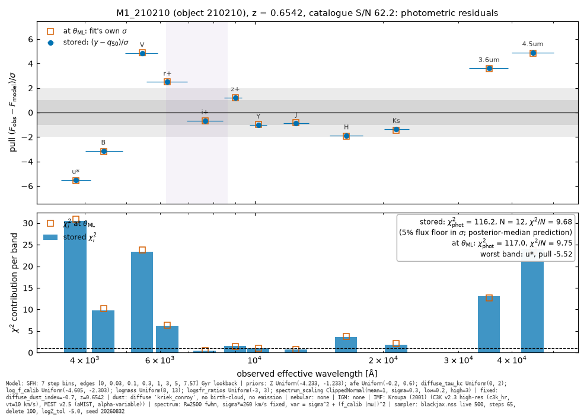
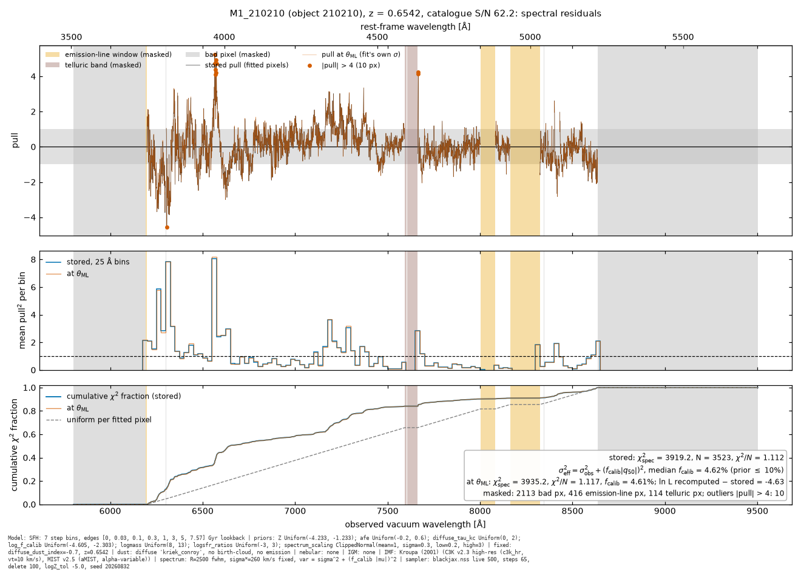
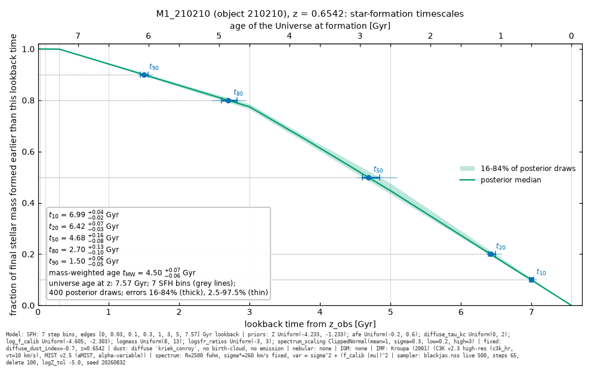

# Per-galaxy chi-squared and star-formation-timescale plots, model parameters stated

Job t_8a78968d · 2026-09-05 · branch `absorption-mask` · figures for this report in `reports/astro-chisq-sf-plots-2026-09-06/`

## What exists now

| Deliverable | Path |
| --- | --- |
| Per-galaxy figures (187 × 3) and model block | `results/rtx-5060-dr2-quiescent-full-spectrum/<target>/diagnostics/{photometric_chi2,spectral_chi2,sf_timescales}.png`, `model_parameters.txt` |
| Table, one row per galaxy (80 columns) | `results/per-galaxy-diagnostics.csv` |
| Executed analysis notebook | `notebooks/ceridwen_per_galaxy_diagnostics.ipynb` |
| Wiki note: method, checks, flags, summaries, GPU verification | `wiki/notes/per-galaxy-fit-diagnostics.md` → `/wiki/n/per-galaxy-fit-diagnostics/` |
| Wiki gallery: every galaxy's three figures inline | `wiki/notes/per-galaxy-diagnostics-gallery.md` → `/wiki/n/per-galaxy-diagnostics-gallery/` |
| Cross-galaxy figures | `wiki/analyses/per-galaxy-diagnostics/{sf-timescale-summary,photometry-summary}.png` |
| Code | `scripts/per_galaxy_diagnostics.py` (library + CLI), `scripts/per_galaxy_diagnostics_vast.py` (GPU verification), `tests/test_per_galaxy_diagnostics.py` (13 tests) |
| Fitting notebook | `notebooks/ceridwen_integrated_photometry_spectra.ipynb` prints the model block from the live model and stores it as `parameter_block` in both HDF5 files |
| GPU verification run | `results/rtx-5060-per-galaxy-diagnostics-verification/` (two refits, `gpu_lnl_check.log`, `refit_vs_production.csv`, `vast_run_20260905T011450Z.json` with the spend) |

Commits `9d7fb7b`, `f7c05aa` and the final commit of 2026-09-05 on `origin/absorption-mask`.

## How the chi-squared is computed, and the check that it uses the fit's sigma

Ceridwen exposes the per-datum normalised residual directly. `DiagonalGaussianLikelihood.__call__` returns `LikelihoodOutput.chi = (y − mu) · sqrt(inv_var)`, zero for masked data, with `chi² / ndof = sum(chi²) / ndof` (`ceridwen/ceridwen/likelihood/likelihood.py:106-136, 234-259`). `inv_var` comes from `DiagonalNoiseModel.compute`: `var = sigma_obs² + (f_calib · |mu|)²` for the spectrum (`noise_model.py:324-350`). No GitHub search was possible (tool profile `fixed-no-web`). The package source is local.

Two definitions appear on every figure:

- **stored**: the fitting notebook's `pull = (y − q50) / sigma_eff`. `q50` is the pointwise posterior median of 200 predictive draws. `sigma_eff² = sigma_obs² + (f_med · |q50|)²` with `f_med` the posterior-median calibration floor. This is what `ceridwen_derived_outputs.h5` holds.
- **at theta_ML**: the `SedModel` is rebuilt from `ceridwen_result.h5` (priors, initial values, redshift, observations) plus the notebook's CSP switches. Ceridwen's own likelihood is evaluated at the dead point with the highest stored log-likelihood. This uses exactly the sigma the sampler used.

Checks over all 187 galaxies:

- Stored masks, sigma and ndof equal the sampler's observation arrays: 187/187. Stored pulls and chi² totals reproduce from their definitions to 1e-12.
- Rebuilt effective sigma matches the stored one to 0.3 %. The residual is the notebook's 2000-draw equal-weight resampling of f_calib.
- Spectral chi² at theta_ML against stored: +0.1 % median, at most 2 %. Photometric chi²: ±4 % (16-84 %), up to 57 %, because a pointwise median of 12 bands is far from any single draw.
- ln L recomputed at theta_ML differs from the stored value of the August production fits by −1.4 (median), −4.0 to +0.3 (16-84 %), extremes −10.7 / +4.6. The GPU verification below shows this is a code-version effect, not sigma, masks or device precision.

Reduced chi² convention: chi²/N per data set (the 13 free parameters are shared, so no per-data-set ndof exists). Joint: chi² / (N_phot + N_spec − 13).

## Accuracy findings and flags

**Photometry is systematically misfit.** Photometric chi²/N: median 7.04 (5-95 %: 2.0–17.5). 157 of 187 galaxies lie above 3. Median pull per band over the sample: u* −0.59, B −1.67, V +1.59, r+ −0.08, i+ −1.95, z+ +0.23, Y −1.76, J −1.02, H −0.97, Ks +0.67, 3.6 µm +3.65, 4.5 µm +4.23. The two IRAC bands are about 4 sigma (≈20 % of flux with the 5 % floor) brighter than the model and supply half of the photometric chi². The worst galaxies are the highest-S/N spectra (S/N 30–45, chi²/N 19–29, IRAC pulls up to 11). The spectrum outweighs the 12 bands by 10²–10³ in summed (S/N)², so the joint fit ignores the broadband shape. Either the 3″ aperture photometry is inconsistent with the IRAC total fluxes, or the model lacks rest-frame 2 µm flux. The 5 % floor does not describe these errors, and the joint chi²/ν of about 1.1 hides it.

**Spectrum.** Spectral chi²/N: median 1.12 (5-95 %: 1.03–1.49). The fitted calibration floor (median 4.8 %) absorbs model mismatch, so chi²/N ≈ 1 by construction. f_calib itself measures the mismatch. 17 galaxies sit at the 10 % prior bound (f_calib ≥ 9.8 %): 139662, 253688, 101089, 185631, 104877, 216899, 98104, 244680, 101830, 259737, 258753, 255047, 162587, 36550, 231554, 87207, 89072. They are the only galaxies with chi²/N > 1.5 (10 of them, worst 139662 at 2.69). For them the fit wanted a larger error floor than the prior allows, so the spectrum errors or the model are wrong. 173 galaxies have pixels with |pull| > 4 (median 5, max 82). For 3400 Gaussian pixels 0.2 are expected, so these are real sky and template residuals.

**Formation timescales.** t_X is the lookback time by which X % of the final mass had formed, so t10 ≥ t20 ≥ t50 ≥ t80 ≥ t90. The summary CSV's t20/t80 are the mirror image, verified equal. Sample medians: t10 4.64, t20 4.23, t50 3.02, t80 1.80, t90 1.39 Gyr. Median 16-84 % half-widths 0.04–0.09 Gyr. 66 galaxies have t50 within 0.1 Gyr of 3.0 Gyr and 12 within 0.1 Gyr of 4.6 Gyr. The 2-Gyr SFH bins quantise every t_X. The small posterior widths are within-bin widths, not age resolution.

## Example galaxy: M1_210210 (z 0.654, S/N 62)



Photometric chi² 116.2 stored (117.0 at theta_ML) over 12 bands, 9.7 per band. Sigma includes the 5 % floor. u* −5.5 sigma, V +4.9, 4.5 µm +4.9.



Spectral chi² 3919 stored (3935 at theta_ML) over 3523 pixels, 1.11 per pixel, with the fit's own sigma (calibration floor 4.6 %). Masks: 2113 bad pixels, 416 emission-line pixels, 114 telluric pixels. 10 outlier pixels beyond 4 sigma. The blue 40 % of pixels (rest 3800–4300 Å) carry 60 % of the chi².



t10 6.99 (+0.04/−0.02), t20 6.42 (+0.07/−0.03), t50 4.68 (+0.16/−0.08), t80 2.70 (+0.13/−0.10), t90 1.50 (+0.06/−0.05) Gyr, 16-84 % over 400 draws. Mass-weighted age 4.50 (+0.07/−0.06) Gyr.

Cross-galaxy: `astro-chisq-sf-plots-2026-09-06/photometry-summary.png`, `astro-chisq-sf-plots-2026-09-06/sf-timescale-summary.png`.

## Model parameter block (generated from the model object, M1_210210)

```
MODEL PARAMETERS (generated from the SedModel object)
Stellar population grid
  library: C3K v2.3 high-res (c3k_hr, vt=10 km/s); isochrones: MIST v2.5 (aMIST, alpha-variable); IMF: imf_type=2 (Kroupa (2001)); schema 2.1
  grid axes: [alpha/Fe] [-0.2, 0, 0.2, 0.4, 0.6]; log10 Z 13 nodes [-4.233, -1.233] (absolute Z); log10(age/Gyr) 107 nodes; wavelength 10992 pts [100, 99595855] A
Star-formation history
  form: piecewise-constant SFR ('step' interpolation) on 7 lookback bins; metallicity history: constant Z
  bin edges (lookback, Gyr): [0, 0.03, 0.1, 0.3, 1, 3, 5, 7.566]  (last edge = universe age at z)
  free parameters: logsfr_ratios[7] = log10(SFR_i / SFR_i+1), transform 'sfh_from_ratios' -> unit-mass SFH (integral 1 Msun); logmass scales the total formed mass
Free parameters and priors
  Z: shape (1,); prior Uniform(-4.233, -1.233); init [-1.85]
  afe: shape (1,); prior Uniform(-0.2, 0.6); init [0.2]
  diffuse_tau_kc: shape (1,); prior Uniform(0, 2); init [0.2]
  log_f_calib: shape (1,); prior Uniform(-4.605, -2.303); init [-3.507]
  logmass: shape (1,); prior Uniform(8, 13); init [11.1]
  logsfr_ratios: shape (7,); prior Uniform(-3, 3); init [0, 0, 0, 0, 0, 0, 0]
  spectrum_scaling: shape (1,); prior ClippedNormal(mean=1, sigma=0.3, low=0.2, high=3); init [1]
Fixed and derived quantities
  redshift: fixed at z = 0.654200 (SedModel.zred); SFH age grid tracks z: False
  diffuse_dust_index: fixed by transform '<lambda>' = [-0.7]
Dust, nebular emission, IGM
  diffuse attenuation: law 'kriek_conroy', parameters ['diffuse_tau_kc', 'diffuse_dust_index']; birth-cloud (age-dependent) dust: False; dust emission: False
  nebular emission: none (spectrum model 'get_spectrum_dattn_nodem_noneb')
  IGM absorption: none
  cosmology: Cosmology(H0=67.66, Om0=0.30966, Tcmb0=2.7255, Neff=3.046, m_nu_ev_sum=0.06)
Observations and calibration
  photometry: Photometry, 12 bands, 12 fitted; filters ['cfht_megacam_us_9301', 'subaru_suprimecam_B', 'subaru_suprimecam_V', 'subaru_suprimecam_rp', 'subaru_suprimecam_ip', 'subaru_suprimecam_zp', 'vista_vircam_Y', 'vista_vircam_J', 'vista_vircam_H', 'vista_vircam_Ks', 'spitzer_irac_ch1', 'spitzer_irac_ch2']
  spectrum: Spectrum, 3523 of 6166 native pixels fitted, 6199-8635 A observed; instrument R = 2500 (R, fwhm); fixed stellar sigma_losvd = 259.5 km/s; CSP-level LOSVD 0.0 km/s
  likelihood[photometry]: DiagonalGaussianLikelihood with DiagonalNoiseModel: var = sigma_obs^2 (no extra terms)
  likelihood[spectrum]: DiagonalGaussianLikelihood with DiagonalNoiseModel: var = sigma_obs^2 + model-scaled fractional floor f_calib*|mu| (log_f_calib free in [1%, 10%])
  likelihood[spectrum] calibration polynomial: none
  spectrum normalisation: free multiplicative spectrum_scaling, prior ClippedNormal(mean=1, sigma=0.3, low=0.2, high=3)
Sampler
  blackjax.nss: num_live 500, num_inner_steps 65, num_delete 100, logZ_tol -5.0; random seed 20260832
```

`model_parameter_block()` reads every line from the `SedModel`, `CSPBasis_afe`, `SSPDataAfe`, `Photometry`, `Spectrum`, `DiagonalGaussianLikelihood`/`DiagonalNoiseModel` objects and the sampler settings. Across the sample only z, the last SFH edge, sigma_losvd, the fitted pixel count and range, the logmass initial value and the seed change. Each figure footer carries a one-paragraph version. Gap found: `write_result_h5` does not persist the CSP switches, the fixed dust index or the smoothing convention. The rebuild takes those from constants mirroring the notebook and compares the block the notebook now stores with the rebuilt one; for both fresh refits the two agree line for line (order-insensitive).

## GPU verification on Vast.ai (RTX 5060)

- Instance 49915972, `NVIDIA GeForce RTX 5060, 8151 MiB, 580.82.09`, host 166946 (UK). Offer $0.1028/h; $0.1222/h with the 40 GB disk.
- Rented 01:14:50 UTC, destroyed 01:40 UTC after 0.427 h. Spend $0.052 at the instance rate ($0.044 at the offer rate, the driver's `spend_estimate_usd`). Account credit fell $0.090, which includes a concurrent job's instance billing in the same window. Cap $2 not approached. Destroy verified: the instance is absent from `vastai show instances` (`vast_run_20260905T011450Z.json`, `instance_destroyed: true`).
- Refits of M1_210210 and M2_139662 with production settings and seeds (500 live points, 65 steps, 100 deletions, logZ_tol −5): both exit 0, both pass `_validate_result`, wall 291 s and 252 s (production: 1196 s and 1119 s).

| Galaxy | ln Z production | ln Z refit | age production | age refit | largest median shift |
| --- | --- | --- | --- | --- | --- |
| M2_139662 | 222329.41 ± 0.25 | 222330.47 ± 0.25 | 5.21 Gyr | 5.10 Gyr (−0.6σ) | 0.4σ (logmass) |
| M1_210210 | 229449.03 ± 0.19 | 229441.28 ± 0.38 | 4.50 Gyr | 4.94 Gyr (+7σ) | 3.6σ (logmass, +0.028 dex) |

GPU log-likelihood check (`gpu_lnl_check.log`): the rebuilt model evaluated on the GPU reproduces the stored ln L(theta_ML) of the fresh fits to −0.002 (M1) and +0.001 (M2_139662); on the CPU −0.06 and −0.02. For the August production fits the GPU gives −4.56 (M1) and +0.01 (M2_139662), the same as the CPU (−4.63, −0.003). So the offset is neither device precision nor sigma nor masks. It is the Ceridwen forward model changing between the August production code and the current tree (the combined static smoother). The project's own re-projection of the 187 stored medians recorded Δχ² mean +3.3, rms 6.2 for that change (`benchmarks/ceridwen/runs/dr2_stored_fit_revalidation_2026-09-01.json`). The four times shorter wall time is the same change.

Flag: for the high-S/N galaxy M1_210210 the current model moves the mass-weighted age by 0.44 Gyr, seven posterior sigma. The production errors (±0.06 Gyr) do not include this implementation systematic. M2_139662 reproduces within one sigma.

## Reproduce

```
ceridwen/.venv/bin/python scripts/per_galaxy_diagnostics.py run          # all 187 galaxies, ~5 min CPU
ceridwen/.venv/bin/python scripts/per_galaxy_diagnostics.py check results/rtx-5060-dr2-quiescent-full-spectrum/210210-M1_210210
ceridwen/.venv/bin/python scripts/per_galaxy_diagnostics.py gallery
ceridwen/.venv/bin/python -m pytest tests/test_per_galaxy_diagnostics.py -q   # 10 passed
python3 wiki/build.py && python3 wiki/tests/run_tests.py                       # all tests passed
ceridwen/.venv/bin/python scripts/per_galaxy_diagnostics_vast.py run --target M1_210210 --target M2_139662 --spend-cap-usd 2
```

## Open items

- The photometric misfit pattern (IRAC +4 sigma, B/i+/Y −2 sigma) needs a decision: total-flux photometry (`CERIDWEN_PHOTOMETRY=cosmos_total` from the concurrent calibration-polynomial job), a larger photometric floor, or a model-side investigation of the rest-frame 2 µm flux.
- The current Ceridwen forward model shifts a high-S/N production age by 7 posterior sigma. Decide whether the 187 production fits should be rerun with the current code (about 5 minutes per galaxy on an RTX 5060, roughly $2 for the sample).
- 17 galaxies at the calibration-floor bound: widen the `log_f_calib` prior or inspect their spectra before using their ages.
- `write_result_h5` should persist the CSP switches and smoothing convention so a result file alone rebuilds the model.
- `html_text_lint` still reports a heuristic `use-list` flag on multi-sentence figure captions (187 in the gallery, 2 in the note). Not actionable.
